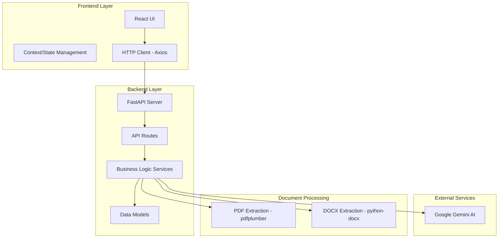
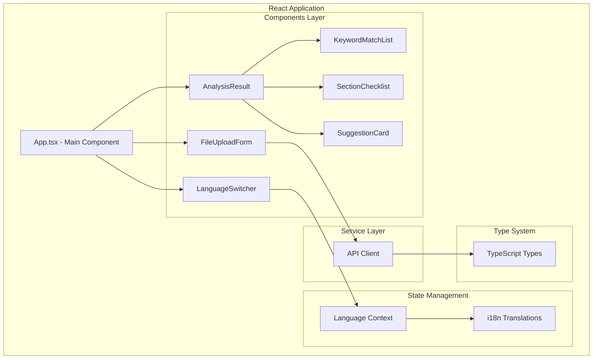
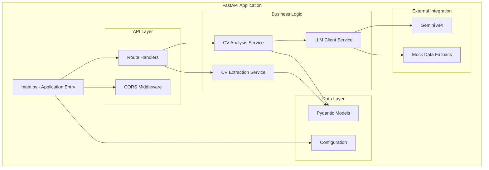
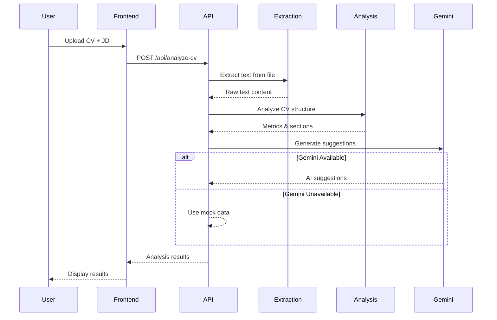
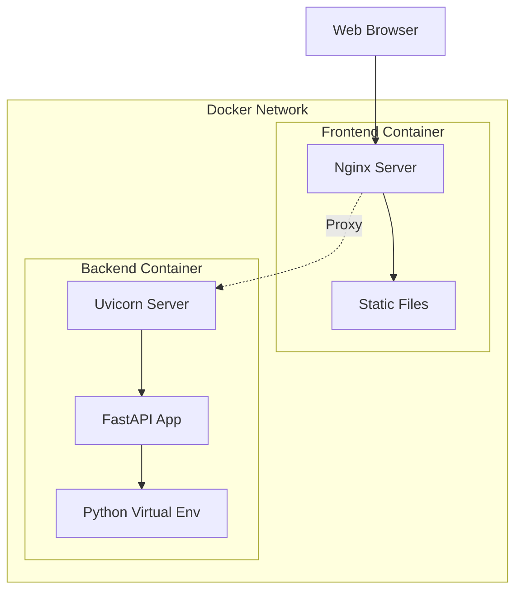
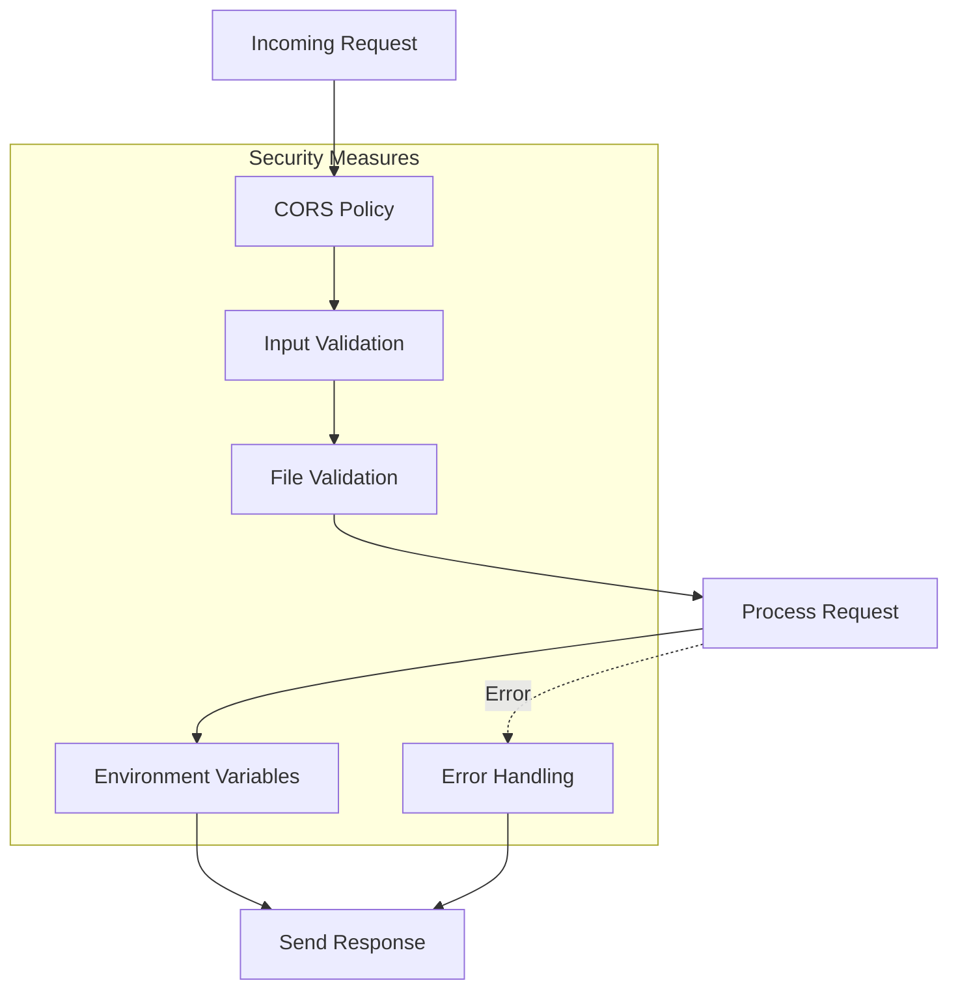
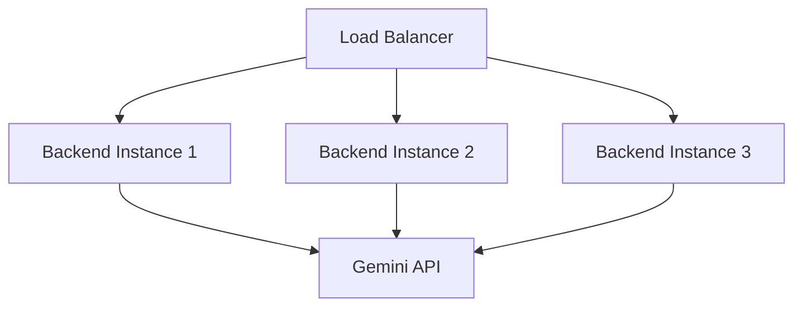

# System Architecture

## Overview

CV Analyzer is a full-stack web application that uses AI to analyze resumes and provide improvement suggestions. The system follows a modern three-tier architecture with clear separation between presentation, business logic, and data processing layers.

## High-Level Architecture

## Component Architecture

### Frontend Architecture

**Key Components**:

1. **FileUploadForm**: Handles file selection and job description input
2. **AnalysisResult**: Displays analysis results and coordinates child components
3. **KeywordMatchList**: Shows keyword matching analysis
4. **SectionChecklist**: Displays section presence indicators
5. **SuggestionCard**: Renders improvement suggestions and examples
6. **LanguageSwitcher**: Toggles between English and Vietnamese

### Backend Architecture

**Key Services**:

1. **cv_extraction.py**: Extracts text from PDF/DOCX files
2. **cv_analysis.py**: Performs rule-based analysis on CV content
3. **llm_client.py**: Manages Gemini API integration with fallback logic

## Data Flow

### CV Analysis Flow

### File Processing Pipeline

```mermaid
graph LR
    Upload[File Upload] --> Validate[Validate Format & Size]
    Validate --> Extract[Extract Text]
    Extract --> Parse[Parse Sections]
    Parse --> Calculate[Calculate Metrics]
    Calculate --> Match[Match Keywords]
    Match --> Generate[Generate AI Suggestions]
    Generate --> Format[Format Response]
    Format --> Return[Return to Client]
```

## Technology Stack Details

### Frontend Technologies

| Technology  | Purpose      | Version |
| ----------- | ------------ | ------- |
| React       | UI Framework | 18.x    |
| TypeScript  | Type Safety  | 5.x     |
| Vite        | Build Tool   | 5.x     |
| TailwindCSS | Styling      | 3.x     |
| Axios       | HTTP Client  | 1.x     |

**Build Process**:

1. TypeScript compilation
2. Module bundling with Vite
3. CSS processing with PostCSS
4. Asset optimization
5. Code splitting for optimal bundle size

### Backend Technologies

| Technology           | Purpose         | Version |
| -------------------- | --------------- | ------- |
| FastAPI              | Web Framework   | 0.104+  |
| Pydantic             | Data Validation | 2.x     |
| pdfplumber           | PDF Processing  | 0.10+   |
| python-docx          | DOCX Processing | 1.1+    |
| Google Generative AI | LLM Integration | Latest  |
| Uvicorn              | ASGI Server     | 0.24+   |

**Request Processing**:

1. ASGI server receives request
2. FastAPI routes to handler
3. Pydantic validates input
4. Business logic processes data
5. Response serialization
6. CORS headers applied

## Deployment Architecture

### Docker Compose Architecture

**Container Configuration**:

- **Frontend**: Nginx serves built React app + proxies API calls
- **Backend**: Uvicorn runs FastAPI with hot reload in dev mode
- **Networking**: Internal Docker network for container communication
- **Volumes**: Mounted for development file sync

### Production Deployment Options

1. **Container Orchestration**:

   - Kubernetes for scalability
   - Docker Swarm for simpler setup
   - AWS ECS/Fargate for managed service

2. **Platform as a Service**:

   - Heroku
   - DigitalOcean App Platform
   - Railway

3. **Traditional VPS**:
   - Nginx reverse proxy
   - Systemd services
   - SSL with Let's Encrypt

## Security Architecture

### Security Layers

**Security Features**:

1. **Input Validation**: Pydantic models validate all inputs
2. **File Validation**: Size limits, format checking, content validation
3. **CORS**: Restricted origins in production
4. **API Key Protection**: Environment variables, never in code
5. **Error Handling**: Generic messages to prevent information leakage

## Performance Considerations

### Frontend Optimization

- **Code Splitting**: Lazy loading of components
- **Asset Optimization**: Minification, compression
- **Caching Strategy**: Browser caching for static assets
- **Bundle Analysis**: Tree shaking, dead code elimination

### Backend Optimization

- **Async Processing**: FastAPI async/await for I/O operations
- **Connection Pooling**: Efficient resource management
- **Caching**: Response caching for common requests
- **Rate Limiting**: Prevent API abuse

## Monitoring & Observability

**Recommended Tools**:

- **Logging**: Structured logging with context
- **Metrics**: Response times, error rates, throughput
- **Tracing**: Request flow through services
- **Health Checks**: Endpoint availability monitoring

## Scalability Strategy

### Horizontal Scaling

**Scaling Considerations**:

- Stateless backend design enables easy horizontal scaling
- Frontend served via CDN for global distribution
- Database layer would require separate scaling strategy
- Queue system for background processing at scale

## Future Architecture Enhancements

1. **Database Integration**: PostgreSQL for user data and history
2. **Caching Layer**: Redis for session and response caching
3. **Message Queue**: RabbitMQ/Celery for async processing
4. **API Gateway**: Rate limiting, authentication, routing
5. **Microservices**: Split into analysis, extraction, and user services
6. **Event-Driven**: WebSocket for real-time updates
